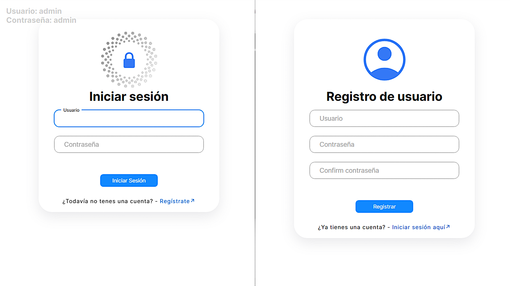

# 🛡️ Sistema de Autenticación - Login y Registro

Este proyecto es una implementación completa de un sistema de login y registro de usuarios con autenticación básica y gestión de sesiones. Está diseñado para ser flexible y soportar diferentes tipos de almacenamiento de usuarios: local (objeto en memoria), MongoDB y MySQL.

## 🚀 Características

- **Registro de Usuarios:** Permite a los nuevos usuarios crear una cuenta con un nombre de usuario y contraseña.
- **Autenticación Básica:** Los usuarios pueden iniciar sesión utilizando sus credenciales.
- **Soporte Multi-Base de Datos:**
  - **NoSQL:** Compatible con **MongoDB**.
  - **Local:** Almacenar las tareas en memoria (basado en objetos).
    **Seguridad de Contraseñas**: Las contraseñas se almacenan de forma segura utilizando **bcrypt** (hashes y salts) para prevenir ataques de fuerza bruta y asegurar la confidencialidad.

* **Gestión de Sesiones con JWT**: Utiliza **JSON Web Tokens (JWT)** para la creación de sesiones seguras y sin estado.
* **Persistencia de Sesión con Cookies**: Las sesiones de usuario se mantienen mediante **cookies** gestionadas con `cookie-parser`.
* **Rutas Protegidas**: Implementación de rutas públicas y privadas para controlar el acceso a diferentes secciones de la aplicación, asegurando que solo los usuarios autenticados puedan acceder a recursos restringidos.
* **Cierre de Sesión**: Funcionalidad para que los usuarios puedan cerrar sus sesiones de forma segura, invalidando el token.
* **Arquitectura MVC**: Separación clara entre la lógica de negocio (backend) y la interfaz de usuario (frontend).

---

## 🧩 Funcionalidades

- 🔐 Registro de usuarios.
- 🔑 Login de usuarios con verificación de credenciales.
- 🧂 Hash de contraseñas con bcrypt (incluye salt).
- 🪪 Generación de JWT para autenticación.
- 🍪 Manejo de sesiones mediante cookies (cookie-parser).
- 🔒 Rutas públicas y privadas.
- 🔁 Verificación de autenticación en rutas protegidas.
- 🚪 Cierre de sesión (logout).

## 🛠️ Tecnologías Utilizadas

- **Backend:**
  - **Node.js**: Entorno de ejecución de JavaScript del lado del servidor.
  - **Express.js**: Framework web para Node.js, utilizado para construir la API.
  - **Bcrypt**: Biblioteca para el hash de contraseñas.
  - **Cookie-parser**: Middleware para parsear cookies en las solicitudes HTTP.
  - **JSON Web Token (JWT)**: Para la creación y verificación de tokens de autenticación.
  - **MongoDB**: Base de datos NoSQL.
  - **MySQL**: Base de datos relacional SQL.
- **Frontend:**
  - **Pug:** Motor de plantillas para generar HTML de forma concisa.
- **Herramientas Generales:**
  - **npm/yarn:** Gestor de paquetes.

---

# API de Gestión de usuario

Esta API permite administrar usuario en la plataforma.

## 🔗 Endpoints

| Método | Ruta      | Protección | Descripción                               |
| ------ | --------- | ---------- | ----------------------------------------- |
| GET    | `/login`  | Pública    | Muestra el formulario de inicio de sesión |
| POST   | `/login`  | Pública    | Procesa el login del usuario              |
| GET    | `/signin` | Pública    | Muestra el formulario de registro         |
| POST   | `/signin` | Pública    | Procesa el registro del usuario           |
| GET    | `/`       | Solo Admin | Página principal protegida (dashboard)    |
| GET    | `/logout` | Privada    | Cierra la sesión del usuario              |

## 🖥️ Capturas de pantalla

